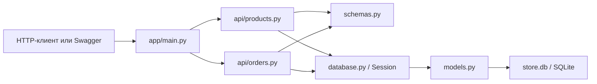

## решение


## настройка и запуск
```
python -m venv .venv
.venv\Scripts\Activate.ps1
pip install fastapi "uvicorn[standard]" "pydantic>=2" "sqlalchemy>=2" fastapi
```

## создание декларативных таблиц
```
DeclarativeBase->
    >Base->
        >Product
        >Order
        >OrderItem
```