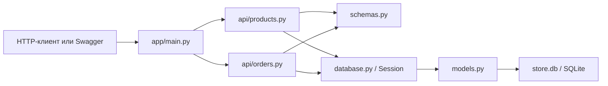

# Internet Store API

Небольшой REST API интернет-магазина для работы с товарами и заказами.

Проект написан на FastAPI, Pydantic 2 и SQLAlchemy 2. В качестве базы данных
используется SQLite. При первом запуске приложение автоматически создаёт файл
`store.db` и необходимые таблицы.

## Стек

- Python 3.11+
- FastAPI
- Pydantic 2
- SQLAlchemy 2
- SQLite
- Uvicorn

## Структура проекта

```text
app/
├── api/
│   ├── orders.py       # маршруты и логика заказов
│   └── products.py     # CRUD товаров
├── database.py         # подключение к БД и создание сессий
├── main.py             # создание FastAPI-приложения
├── models.py           # SQLAlchemy-модели
└── schemas.py          # Pydantic-схемы
```

Связь основных компонентов:



## Установка и запуск

Команды для PowerShell:

```powershell
python -m venv .venv
.\.venv\Scripts\Activate.ps1
python -m pip install --upgrade pip
pip install -r requirements.txt
uvicorn app.main:app --reload
```

После запуска:

- Swagger UI: <http://127.0.0.1:8000/docs>
- OpenAPI-схема: <http://127.0.0.1:8000/openapi.json>
- Проверка работы сервиса: <http://127.0.0.1:8000/health>

## Маршруты

### Товары

- `POST /products` — создать товар;
- `GET /products` — получить список товаров;
- `GET /products/{id}` — получить товар по ID;
- `PATCH /products/{id}` — изменить отдельные поля товара;
- `DELETE /products/{id}` — удалить товар.

### Заказы

- `POST /orders` — создать заказ;
- `GET /orders` — получить список заказов;
- `GET /orders/{id}` — получить заказ по ID.

## Примеры запросов

Создание товара в PowerShell:

```powershell
$product = @{
    name = "Coffee"
    description = "Ground coffee, 250 g"
    price = "450.50"
    stock = 10
} | ConvertTo-Json

Invoke-RestMethod `
    -Uri "http://127.0.0.1:8000/products" `
    -Method Post `
    -ContentType "application/json" `
    -Body $product
```

Создание заказа:

```powershell
$order = @{
    items = @(
        @{
            product_id = 1
            quantity = 2
        }
    )
} | ConvertTo-Json -Depth 3

Invoke-RestMethod `
    -Uri "http://127.0.0.1:8000/orders" `
    -Method Post `
    -ContentType "application/json" `
    -Body $order
```

Получение товаров и заказов:

```powershell
Invoke-RestMethod "http://127.0.0.1:8000/products"
Invoke-RestMethod "http://127.0.0.1:8000/orders"
```

## Принятые решения

- Цена хранится через `Decimal` и `NUMERIC`, чтобы не использовать `float` для
  денежных расчётов.
- Итоговая стоимость заказа рассчитывается только на сервере.
- Перед созданием заказа проверяется существование всех товаров и доступный
  остаток на складе.
- Повторяющиеся позиции одного товара объединяются перед проверкой остатка.
- Создание заказа, его позиций и уменьшение остатков выполняются одной
  транзакцией. При ошибке транзакция откатывается.
- Цена товара сохраняется в позиции заказа как `unit_price`. Изменение текущей
  цены товара не изменяет уже созданные заказы.
- Товар, который используется в заказе, удалить нельзя. API возвращает `409`,
  чтобы не нарушить историю заказа.
- Использован синхронный SQLAlchemy: для небольшого тестового сервиса с SQLite
  этого достаточно, а основная бизнес-логика остаётся проще.

## Ограничения

В проекте нет авторизации, оплаты, доставки, скидок и изменения статусов заказа —
они не входят в требования тестового задания.

